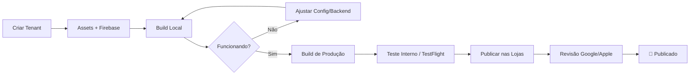
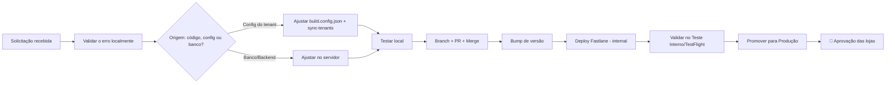

<div align="center">

# 📱 Dev.Mobile

### Anotações, aprendizados e acompanhamento dos projetos mobile


</div>

---

## 📖 Sobre este repositório

Este é meu repositório pessoal de estudos e acompanhamento das aplicações **mobile** da empresa, desenvolvidas em **React Native** com **Expo**, em uma arquitetura **multi-tenant** (um único código-fonte atendendo a múltiplos clientes).

Aqui reúno anotações de processos, roadmaps de publicação, aprendizados técnicos, registros de problemas resolvidos e o acompanhamento de solicitações de ajustes nos aplicativos — servindo tanto como diário de bordo quanto como referência rápida para o futuro.

> 💡 Este repositório é de uso pessoal/estudo. Não contém código-fonte de produção, credenciais ou dados sensíveis das aplicações da empresa.

---

## 🧱 Stack das aplicações acompanhadas

| Camada | Tecnologia |
|---|---|
| Framework | React Native + Expo |
| Roteamento | Expo Router |
| Estado global | Zustand |
| Requisições HTTP | Axios |
| Notificações | Firebase Cloud Messaging |
| Atualizações OTA | Expo Updates (servidor próprio) |
| Publicação Android | Gradle → Google Play Console |
| Publicação iOS | Xcode → App Store Connect |
| Automação (CI/CD) | Fastlane |
| Arquitetura | Multi-tenant (um código-fonte, múltiplos clientes) |

---

## 🗂️ Estrutura do repositório

```
Dev.Mobile/
├── 📁 apps/
│   ├── 📄 AppSiscam8.md          # Anotações e roadmap de publicação
│   ├── 📄 AppSiscam9.md
│   └── ...
│
├── 📁 tenants/
│   ├── 📄 PauloDeFaria.md        # Status, pendências e histórico por cliente
│   ├── 📄 SantaRosaDeViterbo.md
│   └── ...
│
├── 📁 processos/
│   ├── 📄 publicacao-android.md  # Passo a passo consolidado (Play Store)
│   ├── 📄 publicacao-ios.md      # Passo a passo consolidado (App Store)
│   └── 📄 troubleshooting.md     # Erros comuns e soluções
│
├── 📁 solicitacoes/
│   ├── 📄 ITEM-21.txt            # Correção de link de arquivos (Itatiba)
│   └── ...                       # Novas solicitações de ajustes nos apps
│
└── 📄 README.md
```

---

## ✅ Status dos apps acompanhados

| App / Tenant | Android | iOS | Observações |
|---|:---:|:---:|---|
| Paulo de Faria (Siscam8) | 🟡 Em análise | 🟢 Publicado| Primeira publicação enviada para revisão |
| Santa Rosa de Viterbo (Siscam9) | 🟡 Em análise | 🟡 Em análise | App publicado — aguardando análise da Google Play e da App Store |
| Itatiba (Siscam9) | 🟢 Publicado | 🟢 Publicado | Atualização v4.0.10 (ITEM 25) aguardando aprovação das lojas |

**Legenda:** 🟢 Publicado &nbsp;•&nbsp; 🟡 Em análise/revisão &nbsp;•&nbsp; 🔵 Em desenvolvimento &nbsp;•&nbsp; 🔴 Bloqueado/pendente

---

## 🔁 Fluxo geral de publicação



---

## 🔧 Fluxo de correções (solicitações)



---

## 📌 Principais aprendizados registrados

- Diferenças entre build **Debug** e **Release** (assinatura, performance, variáveis de ambiente)
- Particularidades do Windows ao compilar builds Android (arquivos travados no Gradle, antivírus, processos Java pendentes)
- iOS só pode ser buildado em **macOS** — necessidade de Xcode e CocoaPods
- Boas práticas de segurança: nunca versionar `.env`, keystores ou chaves de API
- Diferença entre configuração de **tenant (app)** e configuração de **backend (servidor)** — nem todo problema é resolvido só no código mobile
- O **versionCode** precisa sempre ser incrementado antes de um novo envio às lojas (a Google Play rejeita códigos já utilizados)
- **OTA vs. Loja**: correções somente de JS/config podem ir por OTA (minutos); mudanças nativas exigem novo binário e revisão das lojas (dias)
- Sempre validar a **resposta real do servidor** em scripts de deploy — mensagens de "sucesso" do script podem ser enganosas
- Manter a **versão no Git sincronizada com a versão publicada** nas lojas evita conflitos e erros de versionamento

---

## 🎯 Objetivo

Manter um histórico organizado e consultável dos processos de build, configuração de tenants, publicação e solicitações de correções, evitando retrabalho e servindo como material de consulta para próximos clientes/apps.

---

<div align="center">

*Repositório de uso pessoal — mantido para fins de aprendizado e organização.*

</div>